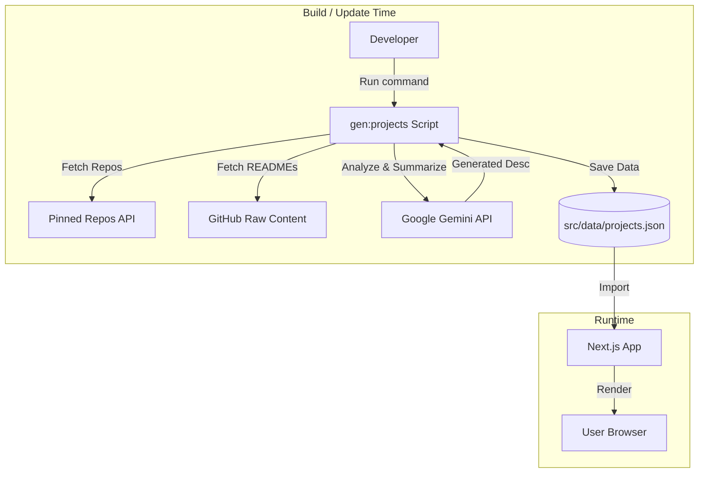

# Portfolio Website

A modern, high-performance portfolio website built with Next.js, featuring interactive UI elements and AI-generated project descriptions.

## 🚀 Features

-   **Interactive Tech Marquee**: Infinite scrolling marquee displaying technology skills.
-   **AI-Powered Project Showcase**: Fetches pinned repositories from GitHub and uses Google Gemini to generate concise descriptions and tech stack tags.
-   **Experience Timeline**: Visual representation of professional experience.
-   **Responsive Design**: optimized for all devices.

## 🛠️ Tech Stack

-   **Framework**: Next.js 15 (React 19)
-   **Styling**: CSS Modules, Framer Motion for animations
-   **Language**: TypeScript
-   **AI Integration**: Google Gemini API (`@google/generative-ai`)
-   **Icons**: Lucide React

## 🏗️ System Design

The project uses a static generation approach for project data to ensure fast load times and avoid API rate limits at runtime.



## ⚙️ Setup & Development

1.  **Clone the repository**
    ```bash
    git clone <repo-url>
    cd portfolio-website
    ```

2.  **Install dependencies**
    ```bash
    npm install
    ```

3.  **Configure Environment**
    Create a `.env.local` file in the root directory:
    ```env
    GEMINI_API_KEY=your_google_gemini_api_key
    ```

4.  **Generate Project Data**
    Fetch your pinned projects and generate AI summaries:
    ```bash
    npm run gen:projects
    ```
    *Note: The script includes rate limiting handling for the Gemini API free tier.*

5.  **Run Development Server**
    ```bash
    npm run dev
    ```

## 🔄 Updating Projects

Since project data is statically generated to ensure performance and stability:

1.  **Pin new repositories** on your GitHub profile.
2.  Run the generation script locally:
    ```bash
    npm run gen:projects
    ```
3.  **Review** the generated `src/data/projects.json` if needed.
4.  **Commit and push** the changes to deploy the update.

> **Why not run in CI/CD?**
> The Gemini API free tier has strict rate limits. Running this script during every build/deployment might cause build failures if the quota is exceeded. Running it locally allows you to handle retries and verify the content before deploying.
